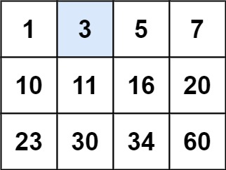
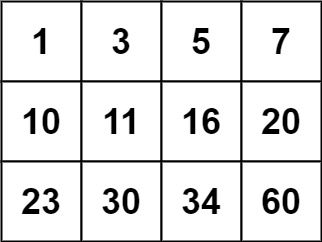
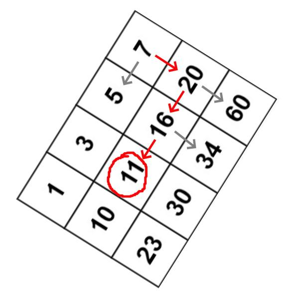

# Binary Search

## Simple Binary Search
```java
public boolean binarySearchIterative(int[] searchSpace, int target) {
    int left = 0;
    int right = searchSpace.length - 1;
    while (left <= right) { // it is very important to put <= and not just <
        // otherwise your program will give wrong answer if the target 
        // happens to be the last element in the search space
        // Take example of searchSpace = [1, 2, 3] and target = 3
        // and see what would happen. 
        // right would be initialized as index 2 and left as 0 giving mid = 1
        // searchSpace[1] = 2 which is < target value 3
        // so right remains same but left becomes  mid + 1 = 1 + 1 = 2
        // now, mid = left + (right - left) / 2 = 2 + (2 - 2) / 2 = 2
        // searchSpace[2] = 3 = target value. Returns true.
        // So here the search would terminate when left = 2 and right = 2.
        int mid = left + (right - left) / 2;
        if (searchSpace[mid] == target) {
            return true;
        } else if (searchSpace[mid] > target) {
            right = mid - 1;
        } else {
            left = mid + 1;
        }

    }
    return false;
}
```
- **Time Complexity**: O(logN)
- **Space Complexity**: O(1)

### Problems
#### Order-agnostic Binary Search (easy)
**Problem Statement:**  
Given a sorted array of numbers, find if a given number ‘key’ is present in the array. Though we know that the array is sorted, we don’t know if it’s sorted in ascending or descending order. You should assume that the array can have duplicates.

Write a function to return the index of the ‘key’ if it is present in the array, otherwise return -1.

**Examples:**  
Example 1:
```
Input: [4, 6, 10], key = 10
Output: 2
```
Example 2:
```
Input: [1, 2, 3, 4, 5, 6, 7], key = 5
Output: 4
```
Example 3:
```
Input: [10, 6, 4], key = 10
Output: 0
```
Example 4:
```
Input: [10, 6, 4], key = 4
Output: 2
```

```java
// Binary search method to find the index of a key in an array
public static int search(int[] arr, int key) {
    int start = 0, end = arr.length - 1;
    boolean isAscending =
        arr[start] < arr[end]; // Check if the array is in ascending order

    while (start <= end) {
        int mid = start + (end - start) / 2; // Calculate the middle index

        if (key == arr[mid])
            return mid; // Key found at the middle index

        if (isAscending) { // If array is in ascending order
            if (key < arr[mid])
                end = mid - 1; // the 'key' can be in the first half, adjust the
                               // end index for the first half
            else
                start = mid + 1; // the 'key' can be in the second half, adjust
                                 // the start index for the second half
        } else { // If array is in descending order
            if (key > arr[mid])
                end = mid - 1; // the 'key' can be in the first half, adjust the
                               // end index for the first half
            else
                start = mid + 1; // the 'key' can be in the second half, adjust
                                 // the start index for the second half
        }
    }
}
```
<hr>

#### Ceiling of a Number (medium)
**Problem Statement:**  
Given an array of numbers sorted in an ascending order, find the ceiling of a given number ‘key’. The ceiling of the ‘key’ will be the smallest element in the given array greater than or equal to the ‘key’.

Write a function to return the index of the ceiling of the ‘key’. If there isn’t any ceiling return -1.

**Examples:**  
Example 1:
```
Input: [4, 6, 10], key = 6
Output: 1
Explanation: The smallest number greater than or equal to '6' is '6' having index '1'.
```
Example 2:
```
Input: [1, 3, 8, 10, 15], key = 12
Output: 4
Explanation: The smallest number greater than or equal to '12' is '15' having index '4'.
```
Example 3:
```
Input: [4, 6, 10], key = 17
Output: -1
Explanation: There is no number greater than or equal to '17' in the given array.
```
Example 4:
```
Input: [4, 6, 10], key = -1
Output: 0
Explanation: The smallest number greater than or equal to '-1' is '4' having index '0'.
```

```java
// Binary search method to find the index of the ceiling value of a key in an
// array
public int searchCeilingOfANumber(int[] arr, int key) {
    if (key > arr[arr.length
            - 1]) // If the 'key' is bigger than the biggest element
        return -1;

    int start = 0, end = arr.length - 1;
    while (start <= end) {
        int mid = start + (end - start) / 2;
        if (key < arr[mid]) {
            end = mid - 1; // Adjust the end index for the first half
        } else if (key > arr[mid]) {
            start = mid + 1; // Adjust the start index for the second half
        } else { // Found the key
            return mid;
        }
    }
    // Since the loop is running until 'start <= end', at the end of the while
    // loop, 'start == end+1' We are not able to find the element in the given
    // array, so the next big number will be arr[start]
    return start;
}
```
<hr>

#### Floor of a Number
**Problem Statement:**  
Given an array of numbers sorted in ascending order, find the floor of a given number ‘key’. The floor of the ‘key’ will be the biggest element in the given array smaller than or equal to the ‘key’

Write a function to return the index of the floor of the ‘key’. If there isn’t a floor, return -1.

**Examples:**  
Example 1:
```
Input: [4, 6, 10], key = 6
Output: 1
Explanation: The biggest number smaller than or equal to '6' is '6' having index '1'.
```
Example 2:
```
Input: [1, 3, 8, 10, 15], key = 12
Output: 3
Explanation: The biggest number smaller than or equal to '12' is '10' having index '3'.
```
Example 3:
```
Input: [4, 6, 10], key = 17
Output: 2
Explanation: The biggest number smaller than or equal to '17' is '10' having index '2'.
```
Example 4:
```
Input: [4, 6, 10], key = -1
Output: -1
Explanation: There is no number smaller than or equal to '-1' in the given array.
```

```java
// Binary search method to find the index of the floor value of a key in an
// array
public int searchFloorOfANumber(int[] arr, int key) {
    if (key < arr[0]) // If the 'key' is smaller than the smallest element
        return -1;

    int start = 0, end = arr.length - 1;
    while (start <= end) {
        int mid = start + (end - start) / 2;
        if (key < arr[mid]) {
            end = mid - 1; // Adjust the end index for the first half
        } else if (key > arr[mid]) {
            start = mid + 1; // Adjust the start index for the second half
        } else { // Found the key
            return mid;
        }
    }

    // Since the loop is running until 'start <= end', at the end of the while
    // loop, 'start == end+1' We are not able to find the element in the given
    // array, so the next smaller number will be arr[end]
    return end;
}
```
<hr>

#### Next Letter (medium)
**Problem Statement:**  
Given an array of lowercase letters sorted in ascending order, find the smallest letter in the given array greater than a given ‘key’.

Assume the given array is a circular list, which means that the last letter is assumed to be connected with the first letter. This also means that the smallest letter in the given array is greater than the last letter of the array and is also the first letter of the array.

Write a function to return the next letter of the given ‘key’.

**Examples:**  
Example 1:
```
Input: ['a', 'c', 'f', 'h'], key = 'f'
Output: 'h'
Explanation: The smallest letter greater than 'f' is 'h' in the given array.
```
Example 2:
```
Input: ['a', 'c', 'f', 'h'], key = 'b'
Output: 'c'
Explanation: The smallest letter greater than 'b' is 'c'.
```
Example 3:
```
Input: ['a', 'c', 'f', 'h'], key = 'm'
Output: 'a'
Explanation: As the array is assumed to be circular, the smallest letter greater than 'm' is 'a'.
```
Example 4:
```
Input: ['a', 'c', 'f', 'h'], key = 'h'
Output: 'a'
Explanation: As the array is assumed to be circular, the smallest letter greater than 'h' is 'a'.
```

```java
public char searchNextLetter(char[] letters, char key) {
    int n = letters.length;
    // if the key is smaller than the first letter or larger than the last
    // letter
    if (key < letters[0] || key > letters[n - 1])
        return letters[0];

    int start = 0, end = n - 1;
    while (start <= end) {
        int mid = start + (end - start) / 2;
        // if the key is smaller than the middle letter, search in the left half
        if (key < letters[mid]) {
            end = mid - 1;
        } else { // if the key is larger than or equal to the middle letter,
                 // search in the right half
            start = mid + 1;
        }
    }

    // Since the loop is running until 'start <= end', at the end of the while
    // loop, 'start == end+1'
    // since the array is circular, use modulo to wrap around
    return letters[start % n];
}
```
<hr>

#### Number Range (medium)
**Problem Statement:**  
Given an array of numbers sorted in ascending order, find the range of a given number ‘key’. The range of the ‘key’ will be the first and last position of the ‘key’ in the array.

Write a function to return the range of the ‘key’. If the ‘key’ is not present return [-1, -1].

**Examples:**  
Example 1:
```
Input: [4, 6, 6, 6, 9], key = 6
Output: [1, 3]
```
Example 2:
```
Input: [1, 3, 8, 10, 15], key = 10
Output: [3, 3]
```
Example 3:
```
Input: [1, 3, 8, 10, 15], key = 12
Output: [-1, -1]
```

**Approach:**  
1. find the lower bound (start index of the key)
2. if lower bound is not `-1`, find the upper bound (end index of the key)

```java
public int[] findRange(int[] arr, int key) {
    int[] result = new int[] {-1, -1};
    result[0] = search(arr, key, false);
    if (result[0]
        != -1) // no need to search, if 'key' is not present in the input array
        result[1] = search(arr, key, true);
    return result;
}

// modified Binary Search
private int search(int[] arr, int key, boolean findMaxIndex) {
    int keyIndex = -1;
    int start = 0, end = arr.length - 1;
    while (start <= end) {
        int mid = start + (end - start) / 2;
        if (key < arr[mid]) {
            end = mid - 1;
        } else if (key > arr[mid]) {
            start = mid + 1;
        } else { // key == arr[mid]
            keyIndex = mid;
            if (findMaxIndex)
                start = mid + 1; // search ahead to find the last index of 'key'
            else
                end = mid - 1; // search behind to find the first index of 'key'
        }
    }
    return keyIndex;
}
```
<hr>

#### Search in a Sorted Infinite Array (medium)
**Problem Statement:**  
Given an infinite sorted array (or an array with unknown size), find if a given number ‘key’ is present in the array. Write a function to return the index of the ‘key’ if it is present in the array, otherwise return -1.

Since it is not possible to define an array with infinite (unknown) size, you will be provided with an interface ArrayReader to read elements of the array. ArrayReader.get(index) will return the number at index; if the array’s size is smaller than the index, it will return `Integer.MAX_VALUE`.

**Examples:**  
Example 1:
```
Input: [4, 6, 8, 10, 12, 14, 16, 18, 20, 22, 24, 26, 28, 30], key = 16
Output: 6
Explanation: The key is present at index '6' in the array.
```
Example 2:
```
Input: [4, 6, 8, 10, 12, 14, 16, 18, 20, 22, 24, 26, 28, 30], key = 11
Output: -1
Explanation: The key is not present in the array.
```
Example 3:
```
Input: [1, 3, 8, 10, 15], key = 15
Output: 4
Explanation: The key is present at index '4' in the array.
```
Example 4:
```
Input: [1, 3, 8, 10, 15], key = 200
Output: -1
Explanation: The key is not present in the array.
```

**Approach:**  
To find the ‘key’ in an infinite sorted array, we can use a modified Binary Search. First, we need to find the bounds of the array by starting with a size of ‘1’ and doubling it until we find the range that contains the key. Then, we can apply Binary Search within that range.

```java
class ArrayReader {
    int[] arr;

    ArrayReader(int[] arr) {
        this.arr = arr;
    }

    public int get(int index) {
        if (index >= arr.length)
            return Integer.MAX_VALUE;
        return arr[index];
    }
}

class SearchInfiniteSortedArray {
    public static int search(ArrayReader reader, int key) {
        // find the proper bounds first
        int start = 0, end = 1;
        while (reader.get(end) < key) {
            int newStart = end + 1;
            end += (end - start + 1) * 2; // increase to double the bounds size
            start = newStart;
        }
        return binarySearch(reader, key, start, end);
    }

    private static int binarySearch(
        ArrayReader reader, int key, int start, int end) {
        while (start <= end) {
            int mid = start + (end - start) / 2;
            if (key < reader.get(mid)) {
                end = mid - 1;
            } else if (key > reader.get(mid)) {
                start = mid + 1;
            } else { // found the key
                return mid;
            }
        }

        return -1;
    }
}
```

**Complexities**
- Time Complexity: There are two parts of the algorithm. In the first part, we keep increasing the bound’s size exponentially (double it every time) while searching for the proper bounds. Therefore, this step will take O(logN) assuming that the array will have maximum ‘N’ numbers. In the second step, we perform the binary search which will take O(logN), so the overall time complexity of our algorithm will be O(logN+logN) which is asymptotically equivalent to O(logN).

- Space Complexity: Constant space O(1).
<hr>

#### Minimum Difference Element (medium)
**Problem Statement:**  
Given an array of numbers sorted in ascending order, find the element in the array that has the minimum difference with the given ‘key’.

**Examples:**  
Example 1:
```
Input: [4, 6, 10], key = 7
Output: 6
Explanation: The difference between the key '7' and '6' is minimum than any other number in the array 
```
Example 2:
```
Input: [4, 6, 10], key = 4
Output: 4
```
Example 3:
```
Input: [1, 3, 8, 10, 15], key = 12
Output: 10
```
Example 4:
```
Input: [4, 6, 10], key = 17
Output: 10
```

**Approach:**  
 We will try to search for the ‘key’ in the given array. If we find the ‘key’ we will return it as the minimum difference number. If we can’t find the ‘key’, (at the end of the loop) we can find the differences between the ‘key’ and the numbers pointed out by indices start and end, as these two numbers will be closest to the ‘key’. The number that gives minimum difference will be our required number.

```java
// A class to find the element in a sorted array that has the minimum difference
// with a given key
class MinimumDifference {
    public static int searchMinDiffElement(int[] arr, int key) {
        // If the key is smaller than the first element, return the first
        // element
        if (key < arr[0])
            return arr[0];
        // If the key is larger than the last element, return the last element
        if (key > arr[arr.length - 1])
            return arr[arr.length - 1];

        // Initialize the start and end pointers for binary search
        int start = 0, end = arr.length - 1;
        while (start <= end) {
            // Find the middle index
            int mid = start + (end - start) / 2;
            // If the key is smaller than the middle element, search in the left
            // half
            if (key < arr[mid]) {
                end = mid - 1;
            }
            // If the key is larger than the middle element, search in the right
            // half
            else if (key > arr[mid]) {
                start = mid + 1;
            }
            // If the key is equal to the middle element, return it as the
            // minimum difference element[^1^][1]
            else {
                return arr[mid];
            }
        }

        // At the end of the loop, start == end + 1
        // We are not able to find the element in the given array
        // Return the element which is closest to the key
        if ((arr[start] - key) < (key - arr[end]))
            return arr[start];
        return arr[end];
    }
}
```
<hr>

#### Bitonic Array Maximum (easy)
**Problem Statement:**  
Find the maximum value in a given Bitonic array. An array is considered bitonic if it is monotonically increasing and then monotonically decreasing. Monotonically increasing or decreasing means that for any index i in the array arr[i] != arr[i+1].

**Examples:**  
Example 1:
```
Input: [1, 3, 8, 12, 4, 2]
Output: 12
Explanation: The maximum number in the input bitonic array is '12'.
```
Example 2:
```
Input: [3, 8, 3, 1]
Output: 8
```
Example 3:
```
Input: [1, 3, 8, 12]
Output: 12
```
Example 4:
```
Input: [10, 9, 8]
Output: 10
```

**Approach:**  
A bitonic array is a sorted array; the only difference is that its first part is sorted in ascending order and the second part is sorted in descending order. We can use a similar approach as discussed in Order-agnostic Binary Search. Since no two consecutive numbers are same (as the array is monotonically increasing or decreasing), whenever we calculate the middle, we can compare the numbers pointed out by the index middle and middle+1 to find if we are in the ascending or the descending part. So:

- If arr[middle] > arr[middle + 1], we are in the second (descending) part of the bitonic array. Therefore, our required number could either be pointed out by middle or will be before middle. This means we will be doing: end = middle.
- If arr[middle] <= arr[middle + 1], we are in the first (ascending) part of the bitonic array. Therefore, the required number will be after middle. This means we will be doing: start = middle + 1.

We can break when start == end. Due to the two points mentioned above, both start and end will be pointing at the maximum number of the bitonic array.

```java
public int binarySearchIterative(int[] arr) {
    int start = 0, end = arr.length - 1;

    while (start < end) { 
        int mid = start + (end - start) / 2;
        if (arr[mid] > arr[mid + 1]) {
            end = mid;
        } else {
            start = mid + 1;
        }
    }

    // at the end of the while loop, 'start == end'
    return arr[start];
}
```
<hr>

#### Search Bitonic Array (medium)
**Problem Statement:**  
Given a Bitonic array, find if a given ‘key’ is present in it. An array is considered bitonic if it is monotonically increasing and then monotonically decreasing. Monotonically increasing or decreasing means that for any index i in the array arr[i] != arr[i+1].

Write a function to return the index of the ‘key’. If the ‘key’ is not present, return -1

**Examples:**  
Example 1:
```
Input: [1, 3, 8, 4, 3], key=4
Output: 3
```
Example 2:
```
Input: [3, 8, 3, 1], key=8
Output: 1
```
Example 3:
```
Input: [1, 3, 8, 12], key=12
Output: 3
```
Example 4:
```
Input: [10, 9, 8], key=10
Output: 0
```

**Approach:**  
- First, we can find the index of the maximum value of the bitonic array, similar to Bitonic Array Maximum. Let’s call the index of the maximum number maxIndex.
- Now, we can break the array into two sub-arrays:
    - Array from index ‘0’ to maxIndex, sorted in ascending order.
    - Array from index maxIndex+1 to array_length-1, sorted in descending order.
- We can then call Binary Search separately in these two arrays to search the ‘key’. 

```java
class SearchBitonicArray {
    public static int search(int[] arr, int key) {
        // find the index of the maximum value in the bitonic array
        int maxIndex = findMax(arr);
        // search the key in the two sub-arrays
        int keyIndex = binarySearch(arr, key, 0, maxIndex);
        if (keyIndex != -1) // found the key
            return keyIndex;
        // search in the descending sub-array
        return binarySearch(arr, key, maxIndex + 1, arr.length - 1);
    }

    // find index of the maximum value in a bitonic array
    public static int findMax(int[] arr) {
        int start = 0, end = arr.length - 1;
        while (start < end) {
            int mid = start + (end - start) / 2;
            if (arr[mid] > arr[mid + 1]) { // if the mid element is bigger than
                                           // its next element
                end = mid; // the max lies in the left half
            } else { // if the mid element is smaller than its next element
                start = mid + 1; // the max lies in the right half
            }
        }
        // at the end of the while loop, 'start == end'
        return start;
    }

    // order-agnostic binary search
    private static int binarySearch(int[] arr, int key, int start, int end) {
        while (start <= end) {
            int mid = start + (end - start) / 2;

            if (key == arr[mid])
                return mid;

            if (arr[start] < arr[end]) { // ascending order
                if (key < arr[mid]) {
                    end = mid - 1; // the 'key' can be in the first half
                } else { // key > arr[mid]
                    start = mid + 1; // the 'key' can be in the second half
                }
            } else { // descending order
                if (key > arr[mid]) {
                    end = mid - 1; // the 'key' can be in the first half
                } else { // key < arr[mid]
                    start = mid + 1; // the 'key' can be in the second half
                }
            }
        }
        return -1; // element is not found
    }
}
```
<hr>

#### Search in Rotated Array (medium)
**Problem Statement:**  
Given an array of numbers which is sorted in ascending order and also rotated by some arbitrary number, find if a given ‘key’ is present in it.

Write a function to return the index of the ‘key’ in the rotated array. If the ‘key’ is not present, return -1. You can assume that the given array does not have any duplicates.

**Examples:**  
Example 1:
```
Input: [10, 15, 1, 3, 8], key = 15
Output: 1
Explanation: '15' is present in the array at index '1'.
```
Example 2:
```
Input: [4, 5, 7, 9, 10, -1, 2], key = 10
Output: 4
Explanation: '10' is present in the array at index '4'.
```

**Approach:**  
- After calculating the middle, we can compare the numbers at indices start and middle. This will give us two options:

    - If arr[start] <= arr[middle], the numbers from start to middle are sorted in ascending order.
    - Else, the numbers from middle+1 to end are sorted in ascending order.
- Once we know which part of the array is sorted, it is easy to adjust our ranges. For example, if option-1 is true, we have two choices:
    - By comparing the ‘key’ with the numbers at index start and middle we can easily find out if the ‘key’ lies between indices start and middle; if it does, we can skip the second part => end = middle -1.
    - Else, we can skip the first part => start = middle + 1.

```java
class SearchRotatedArray {
    public static int search(int[] arr, int key) {
        int start = 0, end = arr.length - 1;

    while (start <= end) { 
        int mid = start + (end - start) / 2;
        if(arr[mid] == key)
            return mid;

        if (arr[start] <= arr[mid]) { // left side is sorted in ascending order
            if(key >= arr[start] && key < arr[mid]) {
                end = mid - 1;
            } else { // key > arr[mid]
                start = mid + 1;
            }
        } else { // right side is sorted in ascending order
            if(key > arr[mid] && key <= arr[end]) {
                start = mid + 1;  
            } else {
                end = mid - 1;
            }
        }
    }

    // we are not able to find the element in the given array
    return -1;
    }
}
```
<hr>

#### Search in Rotated Array with duplicates (medium)
**Problem Statement:**  
How do we search in a sorted and rotated array that also has duplicates?

**Examples:**  
Example 1:
```
Input: [3, 7, 3, 3, 3], key = 7
Output: 1
Explanation: '7' is present in the array at index '1'.
```

**Approach:**  
The only problematic scenario is when the numbers at indices start, middle, and end are the same, as in this case, we can’t decide which part of the array is sorted. In such a case, the best we can do is to skip one number from both ends: start = start + 1 & end = end - 1.

```java
class SearchRotatedWithDuplicate {
    public static int search(int[] arr, int key) {
        int start = 0, end = arr.length - 1;
        while (start <= end) {
            int mid = start + (end - start) / 2;
            if (arr[mid] == key)
                return mid;

            // the only difference from the previous solution,
            // if numbers at indexes start, mid, and end are same, we can't
            // choose a side the best we can do, is to skip one number from both
            // ends as key != arr[mid]
            if ((arr[start] == arr[mid]) && (arr[end] == arr[mid])) {
                ++start;
                --end;
            } else if (arr[start]
                <= arr[mid]) { // left side is sorted in ascending order
                if (key >= arr[start] && key < arr[mid]) {
                    end = mid - 1;
                } else { // key > arr[mid]
                    start = mid + 1;
                }
            } else { // right side is sorted in ascending order
                if (key > arr[mid] && key <= arr[end]) {
                    start = mid + 1;
                } else {
                    end = mid - 1;
                }
            }
        }

        // we are not able to find the element in the given array
        return -1;
    }
}

```
<hr>

#### Rotation Count (medium)
**Problem Statement:**  
Given an array of numbers which is sorted in ascending order and is rotated ‘k’ times around a pivot, find ‘k’.

You can assume that the array does not have any duplicates.

**Examples:**  
Example 1:
```
Input: [10, 15, 1, 3, 8]
Output: 2
Explanation: The array has been rotated 2 times.
```
Example 2:
```
Input: [4, 5, 7, 9, 10, -1, 2]
Output: 5
Explanation: The array has been rotated 5 times.
```
Example 3:
```
Input: [1, 3, 8, 10]
Output: 0
Explanation: The array has not been rotated.
```


**Approach:**  
In this problem, actually, we are asked to find the index of the minimum element. The number of times the minimum element is moved to the right will be equal to the number of rotations. An interesting fact about the minimum element is that it is the only element in the given array which is smaller than its previous element. Since the array is sorted in ascending order, all other elements are bigger than their previous element.

After calculating the middle, we can compare the number at index middle with its previous and next number. This will give us two options:
- If arr[middle] > arr[middle + 1], then the element at middle + 1 is the smallest.
- If arr[middle - 1] > arr[middle], then the element at middle is the smallest.

To adjust the ranges we can follow the same approach as in Search in Rotated Array. Comparing the numbers at indices start and middle will give us two options:
- If arr[start] < arr[middle], the numbers from start to middle are sorted.
- Else, the numbers from middle + 1 to end are sorted.

```java
class RotationCountOfRotatedArray {
    public static int countRotations(int[] arr) {
        int start = 0, end = arr.length - 1;
        while (start < end) {
            int mid = start + (end - start) / 2;
            if (mid < end
                && arr[mid] > arr[mid
                       + 1]) // if mid is greater than the next element
                return mid + 1;
            if (mid > start
                && arr[mid - 1] > arr[mid]) // if mid is smaller than the
                                            // previous element
                return mid;

            if (arr[start] < arr[mid]) { // left side is sorted, so the pivot is
                                         // on right side
                start = mid + 1;
            } else { // right side is sorted, so the pivot is on the left side
                end = mid - 1;
            }
        }

        return 0; // the array has not been rotated
    }
}
```
<hr>

#### Rotation Count With duplicates (medium)
**Problem Statement:**  
How do we find the rotation count of a sorted and rotated array that has duplicates too?

**Examples:**  
Example 1:
```
Input: [3, 3, 7, 3]
Output: 3
Explanation: The array has been rotated 3 times
```


**Approach:**  
We can follow the same approach as in Search in Rotated Array. The only difference is that before incrementing start or decrementing end, we will check if either of them is the smallest number.

```java
class RotationCountWithDuplicates {
    public static int countRotations(int[] arr) {
        if (arr == null || arr.length == 0)
            throw new IllegalArgumentException();

        int start = 0, end = arr.length - 1;
        while (start < end) {
            int mid = start + (end - start) / 2;
            if (mid < end
                && arr[mid] > arr[mid + 1]) // if element at mid is greater than
                                            // the next element
                return mid + 1;
            if (mid > start
                && arr[mid - 1] > arr[mid]) // if element at mid is smaller than
                                            // the previous element
                return mid;

            // this is the only difference from the previous solution
            // if numbers at indices start, mid, and end are same, we can't
            // choose a side the best we can do is to skip one number from both
            // ends if they are not the smallest number
            if (arr[start] == arr[mid] && arr[end] == arr[mid]) {
                if (arr[start] > arr[start + 1]) // if element at start+1 is
                                                 // the smallest
                    return start + 1;
                ++start;
                if (arr[end - 1] > arr[end]) // if the element at end is the
                                             // smallest
                    return end;
                --end;
                // left side is sorted, so the pivot is on right side
            } else if (arr[start] < arr[mid]
                || (arr[start] == arr[mid] && arr[mid] > arr[end])) {
                start = mid + 1;
            } else { // right side is sorted, so the pivot is on the left side
                end = mid - 1;
            }
        }

        return 0; // the array has not been rotated
    }
}
```
<hr>

#### *Search in a 2D Matrix (medium)
**Problem Statement:**  
You are given an m x n integer matrix matrix with the following two properties:

Each row is sorted in non-decreasing order.
The first integer of each row is greater than the last integer of the previous row.
Given an integer target, return true if target is in matrix or false otherwise.

You must write a solution in O(log(m * n)) time complexity.

**Examples:**
Example 1:  

```
Input: matrix = [[1,3,5,7],[10,11,16,20],[23,30,34,60]], target = 3
Output: true
```
Example 2:  

```
Input: matrix = [[1,3,5,7],[10,11,16,20],[23,30,34,60]], target = 13
Output: false
```
**Constraints:**  
- m == matrix.length
- n == matrix[i].length
- 1 <= m, n <= 100
- -10^4 <= matrix[i][j], target <= 10^4

**Approach:**  
If closely analyze the given matrix, we can notice one interesting property: elements on the left are always smaller than the current element, and elements on the bottom are always greater. It reminds us of the Binary Search Tree, doesn't it ? Just look at this matrix from this angle and everything will become clear to you (our target, say, is 11):


**Complexity:**  
- Time: O(n) - in the case we have just one row
- Space: O(1) - nothing stored

```java
class Solution {
public boolean searchMatrix(int[][] matrix, int target) {
        int rows = matrix.length,
			cols = matrix[0].length,
            row = 0, col = cols - 1;
			
        while (row < rows && col > -1) {
            int cur = matrix[row][col];
            if (cur == target) return true;
            if (target > cur) row++;
            else col--;
        }
        
        return false;
    }
}
```

**Optimizations**  

**Approach**  
Don't treat it as a 2D matrix, just treat it as a sorted list

rows * cols matrix convert to an array => matrix[x][y] => a[x * cols + y]

an array convert to rows * cols matrix => a[x] => matrix[x / cols][x % cols];

```java
class Solution {
    public boolean searchMatrix(int[][] matrix, int target) {
        if(matrix.length == 0) return false;

        int rows = matrix.length;
        int columns = matrix[0].length;

        int low = 0;
        int high = rows * columns;

        while(low < high) {
            int mid = (low+high)/2;

            if(matrix[mid/columns][mid%columns] == target) {
                return true;
            } else if (matrix[mid/columns][mid%columns] < target) {
                low = mid+1;
            } else {
                high = mid;
            }
        }
        return false;
    }
}
```

**Complexity:**  
- Time: O(log(mn))
- Space: O(1)
<hr>

## Modified Binary Search Template
```java
public int binarySearch() {
    int left = min(search_space);
    int right = max(search_space);

    while (left <= right) { // terminates when lo == hi
        int mid = left + ((right - left) / 2);
        if (condition(mid)) {
            // ans
            right = mid - 1;
        } else {
            left = mid + 1;
        }
    }
    return left;
}
```

## Tricky Binary Search (Search Space Reduction)
### Problems
#### *Minimum Number of Days to Make m Bouquets (medium)

**Problem Statement:**  
You are given an integer array bloomDay, an integer m and an integer k.

You want to make m bouquets. To make a bouquet, you need to use k adjacent flowers from the garden.

The garden consists of n flowers, the ith flower will bloom in the bloomDay[i] and then can be used in exactly one bouquet.

Return the minimum number of days you need to wait to be able to make m bouquets from the garden. If it is impossible to make m bouquets return -1.

**Examples:**  
Example 1:
```
Input: bloomDay = [1,10,3,10,2], m = 3, k = 1
Output: 3
Explanation: Let us see what happened in the first three days. x means flower bloomed and _ means flower did not bloom in the garden.
We need 3 bouquets each should contain 1 flower.
After day 1: [x, _, _, _, _]   // we can only make one bouquet.
After day 2: [x, _, _, _, x]   // we can only make two bouquets.
After day 3: [x, _, x, _, x]   // we can make 3 bouquets. The answer is 3.
```
Example 2:
```
Input: bloomDay = [1,10,3,10,2], m = 3, k = 2
Output: -1
Explanation: We need 3 bouquets each has 2 flowers, that means we need 6 flowers. We only have 5 flowers so it is impossible to get the needed bouquets and we return -1.
```
Example 3:
```
Input: bloomDay = [7,7,7,7,12,7,7], m = 2, k = 3
Output: 12
Explanation: We need 2 bouquets each should have 3 flowers.
Here is the garden after the 7 and 12 days:
After day 7: [x, x, x, x, _, x, x]
We can make one bouquet of the first three flowers that bloomed. We cannot make another bouquet from the last three flowers that bloomed because they are not adjacent.
After day 12: [x, x, x, x, x, x, x]
It is obvious that we can make two bouquets in different ways.
```

**Constraints:**  
- bloomDay.length == n
- 1 <= n <= 10^5
- 1 <= bloomDay[i] <= 10^9
- 1 <= m <= 10^6
- 1 <= k <= n

**Approach:**  
The intuition behind the solution is based on two key observations:

1. **Sorted Bloom Days**: The bloom days of the flowers are sorted in ascending order. This means that if a flower blooms on a certain day, all the flowers that bloom on the previous days have already bloomed. This property allows us to apply binary search on the bloom days.
2. **Adjacent Flowers for Bouquets**: Each bouquet requires k adjacent flowers. This means that we can’t just pick any k flowers to form a bouquet, they have to be consecutive in the array. This adds a constraint to the problem and makes it more challenging.

Given these observations, the problem becomes finding the minimum number of days to wait such that we can form m bouquets of k adjacent flowers. This is essentially a search problem: we’re searching for the minimum number of days in the range of bloom days that satisfies the bouquet condition.

The binary search algorithm is a perfect fit for this problem because it allows us to efficiently search through the sorted bloom days. We start by defining our search space as the range from the minimum to the maximum bloom day. Then, we repeatedly choose a mid-point in our search space and check if it’s possible to form m bouquets in that many days. If it is, we know that we can wait fewer days, so we reduce our search space to the left half. If it’s not, we know that we need to wait more days, so we increase our search space to the right half. We continue this process until we’ve found the minimum number of days that satisfies the bouquet condition.

**Solution:**
```java
class Solution {
    // Function to find the minimum number of days to wait to make m bouquets.
    public int minDays(int[] bloomDay, int m, int k) {
        // If there are not enough flowers to make m bouquets, return -1.
        if (bloomDay.length < m * k)
            return -1;

        // Initialize the search space to [minEle, maxEle].
        int left = bloomDay[0], right = bloomDay[0];
        int ans = -1;

        // Find the minimum and maximum bloom days.
        for (int day : bloomDay) {
            left = Math.min(left, day);
            right = Math.max(right, day);
        }

        // Binary search over the bloom days.
        while (left <= right) {
            int mid = left + (right - left) / 2;

            // If it's possible to make m bouquets in mid days, update ans and
            // continue searching to the left.
            if (satisfies(mid, bloomDay, m, k)) {
                ans = left;
                right = mid - 1;
            } else { // Otherwise, continue searching to the right.
                left = mid + 1;
            }
        }

        // Return the minimum number of days to wait, or -1 if it's not possible
        // to make m bouquets.
        return ans == -1 ? ans : left;
    }

    // Function to check if it's possible to make numOfBouquets bouquets in
    // numOfDaysToWait days.
    private boolean satisfies(int numOfDaysToWait, int[] bloomDay,
        int numOfBouquets, int numOfAdjFlowers) {
        int cntNumOfBouq = 0, cntNumOfAdj = 0;

        // Iterate over the bloom days.
        for (int d : bloomDay) {
            // If a flower blooms within numOfDaysToWait days, increment the
            // count of adjacent flowers.
            if (d <= numOfDaysToWait) {
                cntNumOfAdj++;
                // If there are enough adjacent flowers for a bouquet, increment
                // the count of bouquets and reset the count of adjacent
                // flowers.
                if (cntNumOfAdj == numOfAdjFlowers) {
                    cntNumOfBouq++;
                    cntNumOfAdj = 0;
                }
            } else { // Otherwise, reset the count of adjacent flowers.
                cntNumOfAdj = 0;
            }
        }

        // Return true if there are enough bouquets, false otherwise.
        return cntNumOfBouq >= numOfBouquets;
    }
}
```
**Complexity:**
- Time: O(n log m), where n is the number of flowers and m is the maximum bloom day
- Space: O(1)
<hr>

#### *Koko Eating Bananas (medium)

**Problem Statement:**  
Koko loves to eat bananas. There are n piles of bananas, the ith pile has piles[i] bananas. The guards have gone and will come back in h hours.

Koko can decide her bananas-per-hour eating speed of k. Each hour, she chooses some pile of bananas and eats k bananas from that pile. If the pile has less than k bananas, she eats all of them instead and will not eat any more bananas during this hour.

Koko likes to eat slowly but still wants to finish eating all the bananas before the guards return.

Return the minimum integer k such that she can eat all the bananas within h hours.

**Examples:**  
Example 1:
```
Input: piles = [3,6,7,11], h = 8
Output: 4
```
Example 2:
```
Input: piles = [30,11,23,4,20], h = 5
Output: 30
```
Example 3:
```
Input: piles = [30,11,23,4,20], h = 6
Output: 23
```

**Constraints:**  
- 1 <= piles.length <= 10^4
- piles.length <= h <= 10^9
- 1 <= piles[i] <= 10^9

**Approach:**  
The solution uses a binary search approach to find the minimum eating speed that allows us to finish all piles in h hours. The minEatingSpeed function first initializes the search space to the range from 1 to the maximum pile size. Then, it performs a binary search over the pile sizes to find the minimum eating speed. The satisfies function checks if it’s possible to finish all piles in h hours with a given eating speed.

**Solution:**
```java
class Solution {
    // Function to find the minimum eating speed to finish all piles in h hours.
    public int minEatingSpeed(int[] piles, int h) {
        // Initialize the search space to [1, maxEle].
        int start = 1, end = 1, ans = 0;

        // Find the maximum pile size.
        for(int pile : piles) {
            end = Math.max(end, pile);
        }

        // Binary search over the pile sizes.
        while(start <= end) {
            int mid = start + (end - start) / 2;

            // If it's possible to finish all piles in h hours with mid eating speed, update ans and continue searching to the left.
            if(satisfies(piles, h, mid)) {
                end = mid - 1;
                ans = mid;
            } else { // Otherwise, continue searching to the right.
                start = mid + 1;
            }
        }

        // Return the minimum eating speed, or 0 if it's not possible to finish all piles in h hours.
        return ans;
    }

    // Function to check if it's possible to finish all piles in h hours with probSpeed eating speed.
    private boolean satisfies(int[] piles, int hour, int probSpeed) {
        int hourTaken = 0;

        // Calculate the total hours taken to finish all piles with probSpeed eating speed.
        for(int pile : piles) {
            hourTaken += Math.ceil(1.0 * pile / probSpeed);
        }

        // Return true if the total hours taken is less than or equal to h, false otherwise.
        return hourTaken <= hour;
    }
}

```
**Complexity:**
- Time: O(n log m), where n is the number of piles and m is the maximum pile size
- Space: O(1)
<hr>

#### *Capacity To Ship Packages Within D Days (medium)

**Problem Statement:**  
A conveyor belt has packages that must be shipped from one port to another within days days.

The ith package on the conveyor belt has a weight of weights[i]. Each day, we load the ship with packages on the conveyor belt (in the order given by weights). We may not load more weight than the maximum weight capacity of the ship.

Return the least weight capacity of the ship that will result in all the packages on the conveyor belt being shipped within days days.

 

**Examples:**  
Example 1:
```
Input: weights = [1,2,3,4,5,6,7,8,9,10], days = 5
Output: 15
Explanation: A ship capacity of 15 is the minimum to ship all the packages in 5 days like this:
1st day: 1, 2, 3, 4, 5
2nd day: 6, 7
3rd day: 8
4th day: 9
5th day: 10

Note that the cargo must be shipped in the order given, so using a ship of capacity 14 and splitting the packages into parts like (2, 3, 4, 5), (1, 6, 7), (8), (9), (10) is not allowed.
```
Example 2:
```
Input: weights = [3,2,2,4,1,4], days = 3
Output: 6
Explanation: A ship capacity of 6 is the minimum to ship all the packages in 3 days like this:
1st day: 3, 2
2nd day: 2, 4
3rd day: 1, 4
```
Example 3:
```
Input: weights = [1,2,3,1,1], days = 4
Output: 3
Explanation:
1st day: 1
2nd day: 2
3rd day: 3
4th day: 1, 1
```

**Constraints:**  
- 1 <= days <= weights.length <= 5 * 10^4
- 1 <= weights[i] <= 500

**Approach:**  
The solution uses a binary search approach to find the minimum ship capacity that allows us to ship all weights within the given days. The shipWithinDays function first initializes the search space to the range from the maximum weight to the total weight. Then, it performs a binary search over the ship capacities to find the minimum ship capacity. The satisfies function checks if it’s possible to ship all weights within the given days with a certain ship capacity.

**Solution:**
```java
class Solution {
    public int shipWithinDays(int[] weights, int days) {
        // min = maxElement (as it's the ship would be able to deliver all the items 
        // only if it's capacity is greater than equal to single shipment) , max = sum
        // search space = [maxElement, sum]

        int start = 0, sum = 0;

        for(int wt : weights) {
            start = Math.max(start, wt);
            sum += wt;
        }

        int end = sum, ans = 0;

        while(start <= end) {

            int mid = start + (end-start)/2;

            if(satisfies(mid, weights, days)) {
                end = mid - 1;
                ans = mid;
            } else {
                start = mid + 1;
            }
        }

        return ans;
    }

    private boolean satisfies(int capacityOfShip, int[] wts, int days) {
        int numOfDaysNeedForGivenShip = 1, shipmentWeight = 0;
        for(int wt : wts) {
            shipmentWeight += wt;
            // if weight of shipment exceeds capacity of ship
            // it needs to be delivery as a seperate shipment
            if(shipmentWeight > capacityOfShip) {
                numOfDaysNeedForGivenShip++;
                shipmentWeight = wt;
                if(numOfDaysNeedForGivenShip > days)
                    return false;
            }
        }
        return numOfDaysNeedForGivenShip <= days;
    }
}
```
**Complexity:**
- Time: O(n log m), O(n log m), where n is the number of weights and m is the total weight. This is because we perform a binary search over the ship capacities, and for each capacity, we check if it’s possible to ship all weights within the given days in O(n) time. 
- Space: O(1)
<hr>
